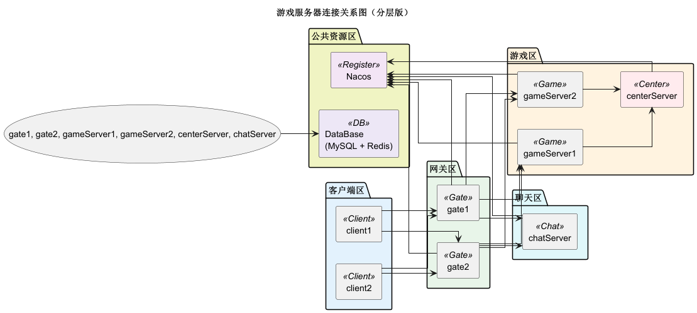

1. sql压测,单独线程池 批量执行 耗时统计
   2025-04-03 16:28:57 [main] WARN - batchExecute 执行SQL, 耗时(41873 毫秒)过长, 执行成功数量:1000 请检查 size:1000
   2.改为用 线程池压测 耗时统计 10 连接池
   batchExecute 执行SQL, 耗时(42347 毫秒)过长, 执行成功数量:1000 请检查 size:1000
   结论 貌似没多大区别

基于nacos 实现的 game server框架 ，目前因为本人只做过 卡牌 肉鸽 和棋牌 所以能支持
