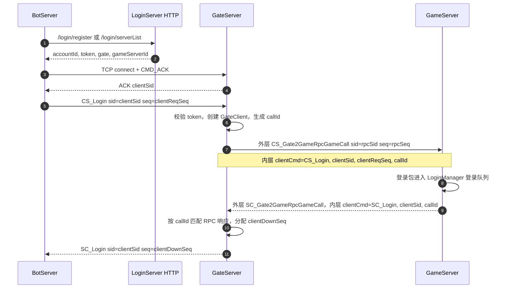
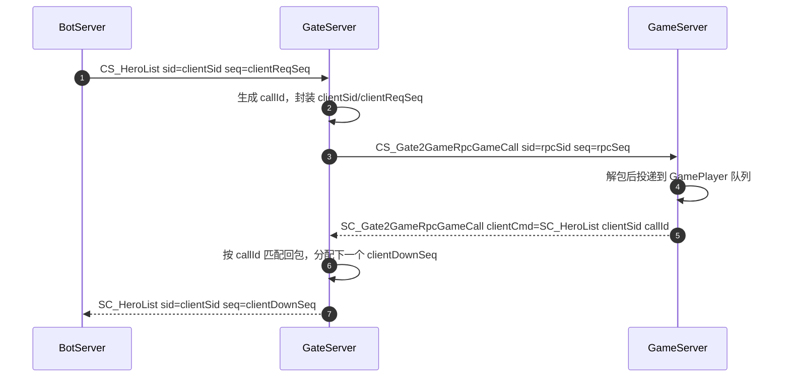

# BotServer 登录与 Gate/Game RPC 流程

本文记录当前已经实现的 `sid / seq / callId` 分层方案，用于排查 BotServer、GateServer、GameServer 之间的登录、业务转发和可靠 RPC 重放。

## 核心原则

`AbstractMessagePacket.seq` 只属于当前 socket，不跨 socket 复用。

| 当前 socket | `AbstractMessagePacket.sid` | `AbstractMessagePacket.seq` |
| --- | --- | --- |
| Bot -> Gate | `clientSid` | `clientReqSeq`，客户端上行日志序号 |
| Gate -> Game | `rpcSid` | `rpcSeq`，服务器间 RPC 外层序号 |
| Gate -> Bot | `clientSid` | `clientDownSeq`，Gate 分配的客户端下行连续序号 |

Gate 转发到 Game 时，客户端上下文只放在二级协议内层字段里：

```proto
message csGate2GameRpcGameCall {
  int32 clientCmd = 1;
  int32 clientSid = 2;
  int64 guid = 3;
  int32 clientReqSeq = 4; // 只做日志和排查，不参与业务判断
  bytes data = 5;
  int64 callId = 6;      // Gate/Game RPC 请求响应匹配
}

message scGate2GameRpcGameCall {
  int32 clientCmd = 1;
  int32 clientSid = 2;
  bytes data = 4;
  int64 callId = 5;
}
```

客户端下行 `clientDownSeq` 由 Gate 在真正写客户端 socket 前统一分配，不由 Game 使用 `clientReqSeq + 1` 推导。

## 登录流程



## 业务包流程



## 可靠 RPC 重放

当 Gate 发送到 Game 失败或超时时，Gate 会把原始 `CS_Gate2GameRpcGameCall` 保存到 Redis outbox。Game 恢复后，Gate 重放时重新写入新的 `callId`。

重放等待线程会从 Gate/Game RPC 连接队列里消费 `SC_Gate2GameRpcGameCall`，所以收到回包后必须调用 Gate 注册的重放回包处理器，继续按 `clientSid` 转发给客户端。如果客户端连接已经不存在，处理器返回失败，outbox 消息保留到下一轮重试。

## 字段语义

| 字段 | 归属 | 用途 |
| --- | --- | --- |
| `clientSid` | Bot-Gate 客户端连接 | 标识客户端当前 Gate socket，Game 日志和回包内层原样携带 |
| `clientReqSeq` | Bot-Gate 上行包 | 只做日志、排查、链路追踪，不参与业务和 RPC 匹配 |
| `clientDownSeq` | Gate 发客户端下行包 | 客户端用来检测下行包是否连续 |
| `rpcSid` | Gate-Game RPC socket | 外层 RPC socket sid，只在服务器间连接有效 |
| `rpcSeq` | Gate-Game RPC socket | 外层 RPC socket seq，只在服务器间连接有效 |
| `callId` | Gate/Game RPC 内层 | 请求响应匹配 ID，普通同步 RPC 和可靠重放统一使用 |

## 线程边界

登录包不在 Game 的 RPC 入站线程里直接执行 DB 操作，而是进入 `LoginManager` 登录协程。在线玩家业务包进入对应 `GamePlayer` 队列。后续如果要继续降低 RPC 入站线程压力，可以把非登录的 lazy DB 加载也拆到专门业务执行器里。
